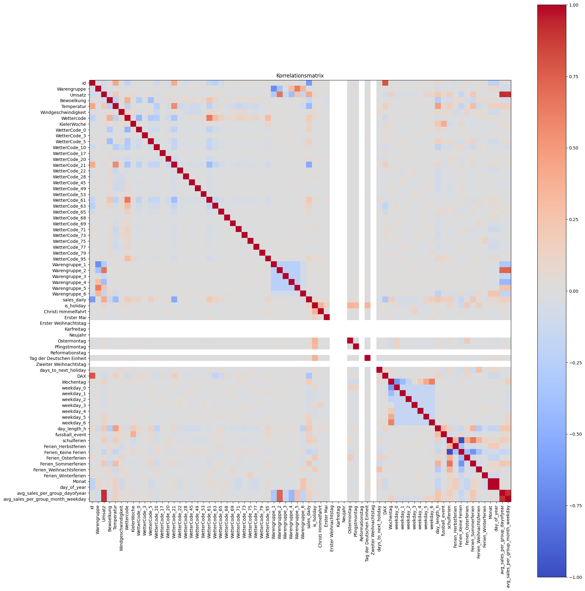
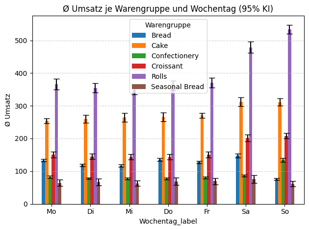

# Dataset Characteristics

## Overview
In the following, the dataset that was merged in 0_DataPreparation is discussed in detail. In the first step we therefore loaded the morged df from the csv. The dataset was already handled in a way, so that it won't have any missing values. a overview is provided and a basic correlation matrix is generated in form of a color coded matrix. In the following part, we played around with plotting the data to generate a basic understanding of when which product group sells well/ which feature is important or not.

## Data Loading
The dataset was generated and stored as a .csv-file in 0_DataPreparation and only has to be imported into the current notebook. For this the read_csv-funciton was used.
```python
merged_df = pd.read_csv("../0_DataPreparation/merged_output.csv")
```
Also we imported most of the library here. These include now matplotlib for plotting the data and scipy stats for statistical analysis.

## Data Overview
This part is mostly generated by AI and gives a basic overview of the merged df. First the dimensions of the df are printed, e.g. number of "features" x "number of dates * procuct groups". Then we printed the names of the columns and their respective datatypes, which mainly consist of the numerical features (float or int). A nice function to get an overview of the data is the display function:
```python
display(merged_df)
```
The display function was also used to provide a basic statistical overview over the content of the columns. here the describe function is used, which is another really useful function in this context.
```python
display(merged_df.describe())
```
The result is shown below. Though there is probably a lot to learn from this image, here some basic facts: The created features avg_sales_per_group_dayofyear and avg_sales_per_group_month_weekday have the highest correlation with the total sales, already indicating that these will dominate the linear regression model. Also some features show "white lines" of zero correlation. These are national holidays, where the bakery shops arent open. Also strong correlation for various different features can be found wth the major school holidays. 


## Feature distribution and dataset exploration

For getting a better understanding of the data set, we created various graphs which might be helpful. These include basic bar plots with confidence intervals for some of the cathegorical features, such as school holidays, football events, weekdays etc. One important type of plot is the Sales per Weekday/Month plot. This is shown in the image below. Many of the trends can be already derived from basic intuition: Breadrolls, Cake and Croissants have higher sales on weekends. And... who ever buys bread on a sunday, straight to jail.


Further data exploration has been done in 3_Model. There we plotted date vs sales per group, as shown in the image below. This helped to further identify trends, such as the "Berliner"-Peak, where the cake sales peak by a factor of ~4. Also a interesting peak can be found, when looking at the seasonal bread sales on St. Nicolaus day. This has not been found by the model, as only national holidays were added as a feature. The package used for displaying the data is plotly and prooved to be a very useful tool. It also allows you to export the data as html, which can be really nice when working with folks who dont have a background in computer sience.
